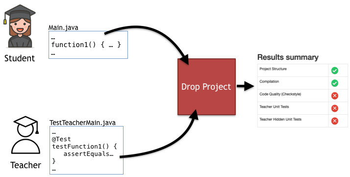

# Drop Project - Continuous Auto-Grader

A web application where students drop their projects to check for correctness and quality.

Several checks are performed on each project:
* Does it have the right folder structure and all the mandatory files?
* Does it compile?
* Does it pass its own tests?
* Does it achieve a minimum coverage with its own tests?
* Does it pass the teacher tests?
* Does it conform to the coding guidelines defined by the teacher?
* Does it perform well? (tests with large datasets are measured)

## Requirements

* Java 8 JDK (a compiler is needed)
* Maven
* Servlet Engine (Tested with tomcat and jetty)
* MySQL

## Current limitations

* Only works for Java 8 / Kotlin non-maven projects

## How does it work?

Most of the work is done by a Maven Invoker, running several goals on the project. 
The results are collected into a report that is viewable by the student and the teacher.

Projects must not be maven projects because they are "mavenized" by the server, after uploading. 
By "mavenizing", I mean copying the files into a proper Maven folder structure (e.g. putting the sources 
into /src/main/java), mixing the student files with the teacher unit tests and adding a pom.xml 
(also provided by the teacher). 

Since checking a project may take some time, it is done asynchronously - the student submits the file and must come 
back later to check the report.

## Quick start

After cloning the repository, change the following properties:

    dropProject.maven.home=<path_to_maven_home>
    dropProject.maven.repository=<path_to_maven_repository>

in the following files:

     src/main/resources/drop-project.properties (to be able to run drop project)
     src/test/resources/drop-project-test.properties (to be able to run drop project's unit tests)

And run the embedded jetty runner:

    mvn jetty:run
    
The application should now be accessible on http://localhost:8080

## Documentation

https://github.com/drop-project-edu/drop-project/wiki/Documentation

To generate source code documentation, run:

    mvn dokka:dokka

The generated documentation will be available in the following folder:

    /target/dokka/drop-project/index.html

## Unit Tests

To execute the unit tests, run:

    mvn test

## Unit Test Coverage

To measure the unit test coverage, run:

    mvn test

Note: to run the coverage measurement, you must first run the tests themselves.

The test coverage report will be available in the following folder:

    /target/site/jacoco/index.html
